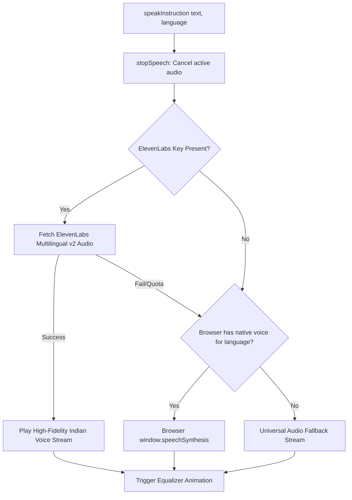
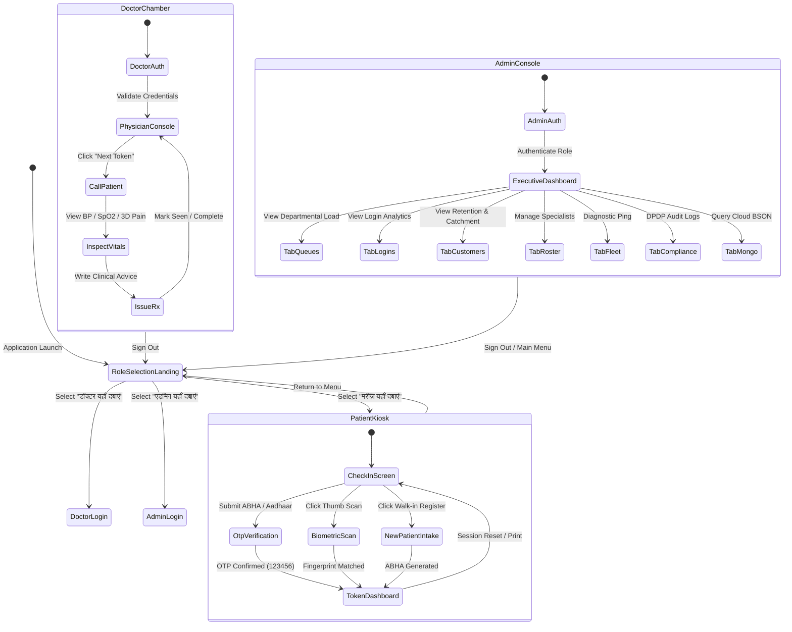

# 🏗️ MediKiosk — System Architecture & Technology Stack

---

## 🏛️ High-Level Technical Architecture

MediKiosk is engineered as a hybrid, offline-resilient healthcare system combining:
1. **Touchscreen Client Layer**: Dual execution modes via React 18 / Vite or zero-dependency standalone HTML (`standalone_kiosk.html`).
2. **Tri-Portal Routing Layer**: Role-based access dividing workflows into **Patient**, **Doctor**, and **Admin** environments.
3. **Clinical Case Taking Layer**: 3D Anatomical Pain Mapping with OpenGL raycasting alongside classical 10-fold Ayurvedic *Dashavidha Pariksha*.
4. **FastAPI Asynchronous Backend**: High-throughput Python REST engine managing queues, notifications, biometrics, and ABDM tokens.
5. **Dual-Database Resilience Engine**: Local **SQLite3 Edge Database** (`medikiosk_edge.db`) ensuring zero-latency offline check-ins, continuously replicating transactions to a centralized **MongoDB Cloud Replica** (`medikiosk_cloud_db`).

```
┌─────────────────────────────────────────────────────────────────────────────┐
│                          1. Presentation & Hardware Layer                   │
│                                                                             │
│   ┌───────────────────────────┐  ┌─────────────────┐  ┌──────────────────┐  │
│   │ Wall / Floor Touch Kiosks │  │ Doctor Chambers │  │  Admin Desktops  │  │
│   └─────────────┬─────────────┘  └────────┬────────┘  └────────┬─────────┘  │
└─────────────────┼─────────────────────────┼────────────────────┼────────────┘
                  │                         │                    │
                  ▼                         ▼                    ▼
┌─────────────────────────────────────────────────────────────────────────────┐
│                  2. Tri-Portal Routing & State Machine (React 18)           │
│                                                                             │
│  ┌───────────────────────┐ ┌───────────────────────┐ ┌───────────────────┐  │
│  │ Patient Portal        │ │ Doctor Portal         │ │ Admin Console     │  │
│  │ (LoginKiosk.jsx)      │ │ (PhysicianDashboard)  │ │ (AdminDashboard)  │  │
│  │ • Trilingual Voice    │ │ • Live Queue Calling  │ │ • 7 Command Tabs  │  │
│  │ • ABHA / Aadhaar OTP  │ │ • 3D Pain Preview     │ │ • User Analytics  │  │
│  │ • Biometric Scanner   │ │ • Dashavidha Score    │ │ • Customer Stats  │  │
│  │ • OPD Token Slip      │ │ • Digital Rx Pad      │ │ • Fleet Telemetry │  │
│  └──────────┬────────────┘ └──────────┬────────────┘ └─────────┬─────────┘  │
└─────────────┼─────────────────────────┼────────────────────────┼────────────┘
              │                         │                        │
              ▼                         ▼                        ▼
┌─────────────────────────────────────────────────────────────────────────────┐
│                       3. Clinical Case Taking Subsystem                     │
│                                                                             │
│  ┌─────────────────────────────────────┐ ┌───────────────────────────────┐  │
│  │ 3D Anatomical Mannequin (PySide6)   │ │ Dashavidha Pariksha (Ayurveda)│  │
│  │ • 3D GLB Raycasting Mesh            │ │ • Prakriti & Vikriti Scoring  │  │
│  │ • Surface-snapped Pain Markers      │ │ • Tissue & Metabolic Profile  │  │
│  │ • VAS 1-10 Severity & Spot JSON     │ │ • Holistic Diet/Lifestyle Rx  │  │
│  └─────────────────────────────────────┘ └───────────────────────────────┘  │
└───────────────────────────────────────┬─────────────────────────────────────┘
                                        │
                                        ▼
┌─────────────────────────────────────────────────────────────────────────────┐
│               4. Asynchronous Python Backend (FastAPI on Port 8000)         │
│                                                                             │
│  ┌─────────────────────────┐ ┌────────────────────────┐ ┌────────────────┐  │
│  │ patient_routes.py       │ │ doctor_routes.py       │ │ admin_routes.py│  │
│  └─────────────────────────┘ └────────────────────────┘ └────────────────┘  │
│  ┌───────────────────────────────────────────────────────────────────────┐  │
│  │ Microservices Layer (ABDM, Biometrics, SMTP Email, Queue Engine)      │  │
│  └───────────────────────────────────────────────────────────────────────┘  │
└───────────────────────┬──────────────────────────────────┬──────────────────┘
                        │                                  │
                        ▼ (Instant Offline Target)         ▼ (Async Stream)
             ┌─────────────────────┐            ┌─────────────────────┐
             │ SQLite3 Edge Engine │            │ MongoDB Cloud Vault │
             │ (medikiosk_edge.db) │            │ (medikiosk_cloud_db)│
             └─────────────────────┘            └─────────────────────┘
```

---

## 💻 Full Technology Stack Breakdown

| Component Area | Technology / Library | Version | Role & Architectural Rationale |
| :--- | :--- | :--- | :--- |
| **Frontend Framework** | **React** | `18.3.1` | Declarative UI, state lifecycle, component reusability across portals. |
| **Styling & CSS** | **Tailwind CSS** | `3.4.17` | Utility-first styling, glassmorphism, responsive kiosks, and keyframe animations. |
| **Build & Tooling** | **Vite** | `6.2.0` | Ultra-fast development HMR, modern ES module bundling. |
| **Zero-Setup Kiosk** | **Standalone HTML5** | Self-contained | Inlined Babel Standalone, React 18, and Tailwind for instant offline execution without Node.js. |
| **Audio Synthesis** | **Web Audio API** | Native Browser | Ultra-low latency synthetic sine/sawtooth sound feedback for touchscreen inputs. |
| **Voice Engine** | **Web Speech API** + **ElevenLabs** | Native / v2 | 3-tier multilingual narration engine across English, Hindi, and Marathi. |
| **Iconography** | **Lucide React** | `0.475.0` | Clean, high-contrast healthcare icons with zero runtime bloat. |
| **3D Anatomical Engine** | **PySide6 + PyOpenGL** | `6.7+` | Desktop 3D interactive mannequin with real-time raycasting and surface snapping. |
| **3D Formats** | **GLTF / GLB** | 2.0 Binary | Standardized anatomical meshes (`medical_body.glb`, `female_base_mesh.glb`, etc.). |
| **Backend Framework** | **FastAPI** | `0.110+` | High-performance Python asynchronous REST framework with auto-generated OpenAPI docs. |
| **ASGI Server** | **Uvicorn** | `0.28+` | Production-grade lightning-fast ASGI server for concurrent kiosk requests. |
| **Edge Database** | **SQLite3** | Native 3.x | Embedded local transactional storage on terminal storage for offline tolerance. |
| **Cloud Database** | **MongoDB** | `6.0+` | Document store for master patient index, historical queues, and FHIR resources. |
| **Data Validation** | **Pydantic** | `2.6+` | Strict schema validation for clinical data payloads and ABDM tokens. |
| **Email Service** | **Python smtplib** | Native 3.x | Asynchronous digital token slips and OTP dispatches via SMTP. |
| **Testing Engine** | **Playwright** | `1.42+` | Automated end-to-end browser regression testing running against official Google Chrome. |

---

## 🔊 3-Tier Multilingual Audio & Speech Subsystem

MediKiosk guarantees audible assistance across rural, semi-literate, and visually impaired user groups:



1. **Tier 1 (High-Fidelity AI)**: ElevenLabs Multilingual v2 model utilizing custom Indian accent voices (`GBJyJih8mGoasC7OSR50` for English, `C2S5J6WvmHnrQWjUu6Rg` for Hindi/Marathi).
2. **Tier 2 (Client Web Speech API)**: Native browser speech synthesizer utilizing regional TTS packs installed on the kiosk operating system.
3. **Tier 3 (Universal Audio Stream)**: Pre-rendered or server-side speech audio clips ensuring voice output even in stripped-down Chromium kiosk browsers.

---

## 🔄 Tri-Portal State Machine (`src/App.jsx`)

The application state machine governs seamless switching between clinical roles without data corruption:


